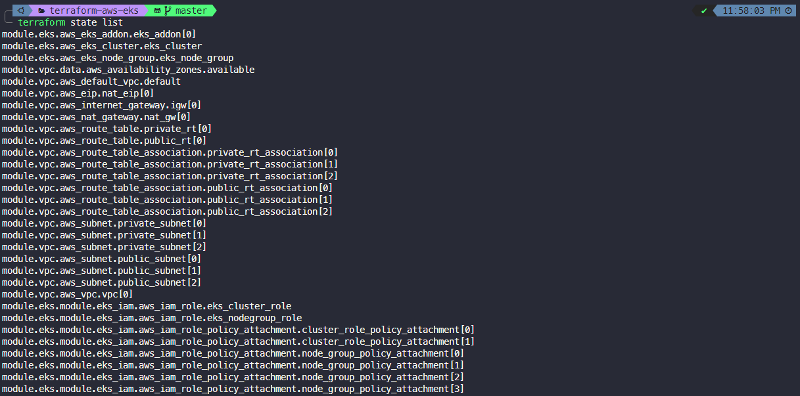
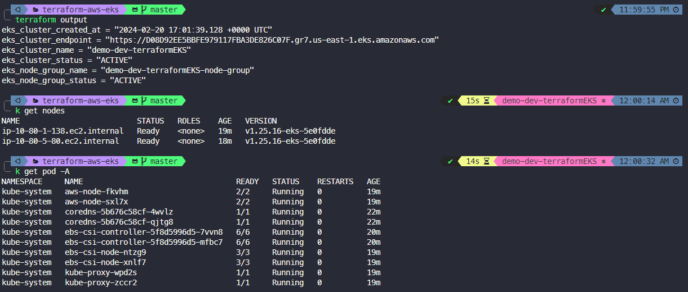

<h2 align="center">terraform-aws-eks🚀</h2>
<p align="center">This repo is created for eks cluster setup with managed node group.  </p>

>💡 “Note: This project is intended for lab testing purposes, not for production. Additionally, it focuses on creating the cluster and does not cover cluster auto-scaling at this stage.”   


# Module input and output  
module location: [modules/wy_eks](modules/wy_eks)
### Input

| Input                   | Default Value                                            |
| :---------------------- | :------------------------------------------------------- |
| project_name            | terraform_aws_eks                                        |
| env_prefix              | test                                                     |
| eks_cluster_name        | wwwaiyan-terraform-eks-cluster                           |
| eks_cluster_version     | 1.28                                                     |
| nodegroup_instance_types | t3.small                                                |
| eks_cluster_subnets      | require to add your subnet ids                          |
| eks_nodegroup_subnets    | require to add your subnet ids                          |
| eks_addon_name           | (optional) if you need to add **add_on** [learn more](https://docs.aws.amazon.com/eks/latest/userguide/eks-add-ons.html) |
| cluster_role_policy_arns |(optional) if you need to add other additional **policy** [learn more](https://docs.aws.amazon.com/aws-managed-policy/latest/reference/policy-list.html)|
| node_group_role_policy_arns |(optional) if you need to add other additional **policy** [learn more](https://docs.aws.amazon.com/aws-managed-policy/latest/reference/policy-list.html)|  

**📝eks module add_on note** : `eks_addon_name`  
By default, the add on will not be added. If you need, you can add the add_on.  
For example: `eks_addon_name = "aws-ebs-csi-driver"`  
Can adjust values in `main.tf` or `variable.tf`  
Learn More about [Amazon EKS add-ons](https://docs.aws.amazon.com/eks/latest/userguide/eks-add-ons.html)  

**📝eks module iam_policy note** : `cluster_role_policy_arns` and `node_group_role_policy_arns`     
By default, eks  required policy will be added [learn more  required policy](https://docs.aws.amazon.com/eks/latest/userguide/using-service-linked-roles.html). You can add the other additional policies.    
For example: `node_group_role_policy_arns = "arn:aws:iam::aws:policy/service-role/AmazonEBSCSIDriverPolicy"`  
Can adjust values in `main.tf` or `variable.tf`  
Learn More about [AWS managed policies list](https://docs.aws.amazon.com/aws-managed-policy/latest/reference/policy-list.html)

### Output
 - eks_cluster_name
 - eks_cluster_status
 - eks_cluster_endpoint
 - eks_cluster_created_at
 - eks_node_group_name
 - eks_node_group_status  
> Can adjust input and output values in `variable.tf` and `output.tf`

# Example :
```hcl
module "vpc" {
  source                  = "github.com/wwwaiyan/terraform-aws-vpc/modules/wy_vpc"
  project_name            = var.project_name
  env_prefix              = var.env_prefix
  vpc_cidr                = var.vpc_cidr
  public_subnet_cidr      = var.public_subnet_cidr
  private_subnet_cidr     = var.private_subnet_cidr
  create_nat              = var.create_nat #required public_subnet_cidr
  public_subnet_for_nat   = var.public_subnet_for_nat
  azs                     = var.azs
  map_public_ip_on_launch = var.map_public_ip_on_launch
}
locals {
  eks_subnets = concat(module.vpc.private_subnet_ids, module.vpc.public_subnet_ids)
}
module "eks" {
  source                      = "github.com/wwwaiyan/terraform-aws-eks/modules/wy_eks"
  project_name                = var.project_name
  env_prefix                  = var.env_prefix
  eks_cluster_subnets         = local.eks_subnets
  eks_nodegroup_subnets       = local.eks_subnets
  eks_cluster_name            = var.eks_cluster_name
  eks_cluster_version         = var.eks_cluster_version
  nodegroup_instance_types    = var.nodegroup_instance_types
  eks_addon_name              = var.eks_addon_name
  cluster_role_policy_arns    = var.cluster_role_policy_arns
  node_group_role_policy_arns = var.node_group_role_policy_arns
}
```  
### 1. Clone the module repository
```
 git clone https://github.com/wwwaiyan/terraform-aws-eks.git && cd terraform-aws-eks
```  
can edit the values in `variable.tf` or `main.tf`  
### 2. Run `terraform init` and `terraform apply` Command  
```
terraform init && terraform apply
```
we can check terraform state with `terraform state list` command  

In this case, the EKS cluster is created using the root module, which includes the following resources:    
✔️ Created VPC and subnets for EKS Cluster - [terraform-aws-vpc](https://github.com/wwwaiyan/terraform-aws-vpc)  
✔️ Created EKS Cluster with managed node group  
✔️ Added cluster context in default kubeconfig (ready to use `kubectl`)

## screenshots: 

  
  

### 3. Cleanup your resources.  
Run `terraform destroy` command.  

<H3 align="center">Happy Coding! Happy Clustering... 🌟🚀😊</H3>